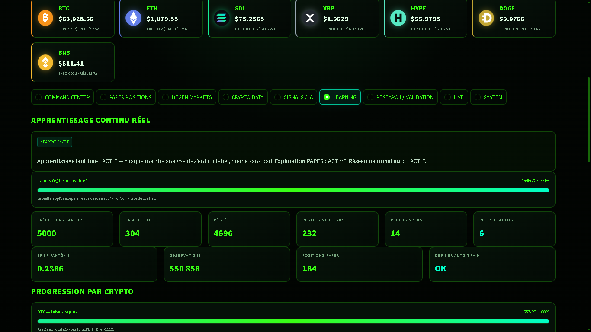

# JupiterDegenEdgeBot V1.0

<p align="center">
  
</p>

<p align="center">
  <strong>Quantitative research, adaptive learning and automated analysis for Jupiter Prediction Markets on Solana.</strong>
</p>

<p align="center">
  PAPER • SHADOW • TIMED 5m/15m • Adaptive Learning • Neural Research • Optional LIVE Execution
</p>

---

# English

## Overview

**JupiterDegenEdgeBot V1.0** is a Windows-first quantitative research and prediction-market bot designed for the **Jupiter Prediction ecosystem on Solana**.

The project combines:

- Jupiter Prediction market discovery
- YES / NO prediction-market analysis
- Short-duration UP / DOWN market research
- Multi-source cryptocurrency data
- Quantitative probability estimation
- PAPER trading
- SHADOW learning
- Adaptive profiles
- 5-minute / 15-minute TIMED Direction analysis
- Neural-model research and validation
- Brier score and log-loss calibration
- Local AI-assisted review through Ollama
- SQLite persistence
- Streamlit monitoring dashboard
- Optional protected LIVE execution
- Position reconciliation
- Claim monitoring and handling

> **Default safety:** the public release starts in **PAPER mode**.
>
> Real-money LIVE execution is disabled until the user explicitly enables it.

> **Important:** JupiterDegenEdgeBot is an experimental research project.
>
> It does not guarantee profitability and does not constitute financial or investment advice.

---

# Main Capabilities

## Supported crypto assets

The current release monitors:

- **BTC** — Bitcoin
- **ETH** — Ethereum
- **SOL** — Solana
- **XRP** — XRP
- **HYPE** — Hyperliquid
- **DOGE** — Dogecoin
- **BNB** — BNB

Each asset can maintain independent:

- Market observations
- Predictions
- Calibration statistics
- Adaptive profiles
- TIMED Direction statistics
- Neural research results
- LIVE eligibility state

---

# Jupiter Prediction Market Analysis

The bot discovers Jupiter Prediction markets and evaluates them using quantitative probability estimates.

Supported research includes:

- YES / NO markets
- Crypto price targets
- Crypto price ranges
- Directional markets
- Short-duration prediction markets
- 5m / 15m UP / DOWN markets

The general decision process is:

```text
Jupiter market
      ↓
Market probability
      ↓
Crypto data
      ↓
Quantitative features
      ↓
Model probability
      ↓
Model probability vs market probability
      ↓
Estimated statistical edge
      ↓
Risk and quality filters
      ↓
SHADOW / PAPER / optional LIVE
```

A prediction does **not** automatically become a trade.

The system can correctly decide:

```text
NO TRADE
```

when available opportunities do not satisfy the required conditions.

---

# YES / NO Markets

The main market engine evaluates standard Jupiter Prediction contracts.

For each candidate, the bot can compare:

```text
Model probability
        vs
Jupiter market probability
        ↓
Estimated edge
```

The engine may evaluate:

- YES probability
- NO probability
- Entry price
- Estimated edge
- Confidence
- Reliability
- Market liquidity
- Spread
- Price movement
- Risk limits
- Current exposure
- Existing positions

The bot is designed to reject an opportunity when the statistical or risk conditions are insufficient.

---

# TIMED Direction V2 — 5m / 15m UP-DOWN

JupiterDegenEdgeBot includes a dedicated short-horizon subsystem called:

```text
TIMED Direction V2
```

It is designed to research short-duration directional cryptocurrency markets such as:

```text
BTC UP / DOWN
ETH UP / DOWN
SOL UP / DOWN
XRP UP / DOWN
HYPE UP / DOWN
DOGE UP / DOWN
BNB UP / DOWN
```

The TIMED subsystem operates independently from the slower general prediction-market cycle.

Typical workflow:

```text
Jupiter 5m / 15m market
        ↓
Crypto market snapshot
        ↓
Feature extraction
        ↓
TIMED probability model
        ↓
SHADOW prediction
        ↓
Market expiration
        ↓
Actual result
        ↓
Prediction resolution
        ↓
Brier score
        ↓
Log-loss
        ↓
Calibration statistics
```

---

# Continuous TIMED Learning

A critical design principle is the separation between:

```text
LEARNING
```

and:

```text
LIVE AUTHORIZATION
```

The TIMED worker continues collecting research observations even when an asset currently has:

```text
live_ready=False
```

This means:

```text
Asset not LIVE-ready
        ↓
SHADOW/PAPER learning continues
        ↓
New results are collected
        ↓
Brier/log-loss can continue evolving
        ↓
Asset may become LIVE-ready later
```

LIVE eligibility must never prevent the model from collecting the new labels required for future calibration.

---

# PAPER Mode

PAPER mode simulates positions without using real funds.

The public release starts with:

```env
TRADING_MODE=paper
AUTO_EXECUTE=false
LIVE_RELEASE_ENABLED=false
TIMED_DIRECTION_LIVE_ENABLED=false
```

PAPER mode allows the user to evaluate:

- Signals
- Entry logic
- Market selection
- Calibration
- Model quality
- Risk rules
- Position management

without putting real funds at risk.

---

# SHADOW Learning

SHADOW predictions record model decisions without sending an actual order.

SHADOW learning is used for:

- Probability calibration
- Brier score calculation
- Log-loss calculation
- Prediction accuracy
- Model comparison
- TIMED Direction research
- Adaptive learning
- Historical analysis
- Validation

Example:

```text
Prediction created
        ↓
Status = OPEN
        ↓
Market expires
        ↓
Actual result obtained
        ↓
Status = RESOLVED
        ↓
Brier/log-loss updated
```

---

# Adaptive Learning

JupiterDegenEdgeBot contains an adaptive research layer capable of maintaining multiple profiles.

Profiles may represent different combinations of:

- Asset
- Market type
- Prediction horizon
- Feature regime
- Model configuration
- Calibration state
- Market behavior

The dashboard may display:

```text
ADAPTIVE PHASE: ACTIVE
ACTIVE PROFILES: 14
```

The user does not normally need to manually manage these profiles.

The system updates its adaptive state automatically as new observations become available.

The number of active profiles may increase or decrease over time.

---

# Neural Research

The project includes bounded neural-model research functionality.

Neural models are not automatically promoted simply because they perform well during training.

The validation process can include:

- Training evaluation
- Validation dataset evaluation
- Out-of-sample testing
- Walk-forward validation
- Brier score comparison
- Log-loss comparison
- Baseline comparison
- Calibration evaluation
- Promotion / rejection rules

A neural model may remain inactive when its validation performance is insufficient.

This is intentional.

---

# Probability Calibration

## Brier Score

The Brier score measures the accuracy of probabilistic predictions.

For a binary prediction:

```text
Prediction probability = 0.70
Actual result          = 1
```

the score measures the distance between the predicted probability and the final outcome.

Lower Brier scores generally indicate better probabilistic calibration.

---

## Log-Loss

Log-loss evaluates probability quality while penalizing highly confident incorrect predictions more strongly.

This helps prevent models from becoming excessively confident.

---

# TIMED LIVE Calibration Gate

TIMED Direction LIVE execution can require conditions such as:

```text
Minimum resolved observations
Minimum independent events
Maximum Brier score
Maximum log-loss
```

An asset may therefore have:

```text
live_ready=False
```

while continuing to learn.

When enough valid data has been collected and the statistical requirements are satisfied, the state may become:

```text
live_ready=True
```

This does not guarantee that a LIVE trade will be taken.

Other risk and execution conditions must still pass.

---

# Multi-Source Crypto Data

The quantitative engine can combine observations from multiple crypto-market sources when available.

The objective is to avoid relying exclusively on one exchange or one price feed.

Possible data inputs include:

- Spot prices
- Price changes
- Short-term momentum
- Cross-exchange observations
- Market dispersion
- Directional movement
- Volatility information
- Prediction-market probability
- Time to expiration
- Market liquidity
- Spread information

The exact data sources and features may evolve in future releases.

---

# Local AI Review with Ollama

JupiterDegenEdgeBot can use a local Ollama model as an additional research/review component.

Default model:

```text
qwen2.5:1.5b-instruct-q4_K_M
```

The local AI reviewer is **not the primary trading engine**.

Quantitative probabilities, calibration rules and risk controls remain authoritative.

Ollama is primarily used as an additional local analysis and review layer.

---

# Dashboard

The project includes a local Streamlit dashboard.

Default address:

```text
http://127.0.0.1:8501
```

The dashboard can display:

- Current crypto prices
- Wallet state
- Capital
- LIVE exposure
- PAPER exposure
- Realized P&L
- Unrealized P&L
- Claimable positions
- Current market decision
- Model probability
- Market probability
- Estimated edge
- Confidence
- Reliability
- Current cycle
- Signals
- PAPER orders
- LIVE orders
- Adaptive-learning state
- Active profiles
- Research status
- Neural validation
- Database usage
- System state

Start the dashboard with:

```powershell
.\DASHBOARD.ps1
```

---

# Architecture

```text
                    ┌────────────────────────┐
                    │   Jupiter Prediction   │
                    └────────────┬───────────┘
                                 │
                                 ▼
                    ┌────────────────────────┐
                    │    Market Discovery    │
                    └────────────┬───────────┘
                                 │
                ┌────────────────┴────────────────┐
                │                                 │
                ▼                                 ▼
     ┌────────────────────┐            ┌────────────────────┐
     │ General YES / NO   │            │ TIMED 5m / 15m    │
     │ Prediction Markets │            │ UP / DOWN Markets  │
     └──────────┬─────────┘            └──────────┬─────────┘
                │                                 │
                ▼                                 ▼
     ┌────────────────────┐            ┌────────────────────┐
     │ Quantitative       │            │ FAST TIMED         │
     │ Analysis           │            │ Analysis           │
     └──────────┬─────────┘            └──────────┬─────────┘
                │                                 │
                └────────────────┬────────────────┘
                                 │
                                 ▼
                    ┌────────────────────────┐
                    │ Probability Models     │
                    └────────────┬───────────┘
                                 │
                                 ▼
                    ┌────────────────────────┐
                    │ SHADOW / PAPER         │
                    │ Learning               │
                    └────────────┬───────────┘
                                 │
                                 ▼
                    ┌────────────────────────┐
                    │ Adaptive / Neural      │
                    │ Research               │
                    └────────────┬───────────┘
                                 │
                                 ▼
                    ┌────────────────────────┐
                    │ Brier / Log-loss       │
                    │ Calibration            │
                    └────────────┬───────────┘
                                 │
                                 ▼
                    ┌────────────────────────┐
                    │ LIVE Safety Gates      │
                    └────────────┬───────────┘
                                 │
                                 ▼
                    ┌────────────────────────┐
                    │ Optional LIVE Trade    │
                    └────────────────────────┘
```

---

# Requirements

Recommended environment:

- Windows 10 or Windows 11
- PowerShell
- Python
- Node.js LTS
- npm
- Ollama
- Jupiter API key
- Internet connection

Python 3.13 is recommended for the Windows release.

Python 3.11–3.13 may be used depending on the environment and installed dependencies.

---

# Quick Installation — Windows

## Fresh Windows installation

Open PowerShell inside the project directory:

```powershell
Set-ExecutionPolicy -Scope Process Bypass -Force
.\SETUP_FROM_ZERO_WINDOWS.ps1
```

Then open the configuration file:

```powershell
notepad .env
```

---

## If Python and Node.js are already installed

Run:

```powershell
Set-ExecutionPolicy -Scope Process Bypass -Force
.\INSTALL.ps1
.\INSTALL_OLLAMA.ps1 -InstallIfMissing
```

Then:

```powershell
notepad .env
```

---

# Jupiter API Key

A Jupiter API key is required for the relevant Jupiter Prediction API functionality.

Inside `.env`:

```env
JUPITER_API_KEY=PASTE_YOUR_JUPITER_API_KEY_HERE
```

The Jupiter API key must remain private.

Do not upload your personal `.env` file to GitHub.

---

# Ollama Installation

Install Ollama:

```powershell
irm https://ollama.com/install.ps1 | iex
```

Install the default local model:

```powershell
ollama pull qwen2.5:1.5b-instruct-q4_K_M
```

Check Ollama:

```powershell
.\OLLAMA_STATUS.ps1
```

The configured model can be changed through:

```env
OLLAMA_MODEL=
```

Additional information:

```text
docs/OLLAMA.md
```

---

# Validate the Installation

Before starting the bot:

```powershell
.\DOCTOR.ps1
.\OLLAMA_STATUS.ps1
.\SOURCE_TEST.ps1
.\SCAN_ONCE.ps1
```

Then start the bot:

```powershell
.\START_BOT.ps1
```

Start the dashboard:

```powershell
.\DASHBOARD.ps1
```

Dashboard address:

```text
http://127.0.0.1:8501
```

---

# First Run Behavior

The public package intentionally contains no personal runtime state.

A new installation should not include:

```text
Personal .env
Private wallet
Private keys
Personal SQLite database
Personal logs
Personal backups
Previously trained private models
```

A fresh installation creates its own local database and begins learning from new market observations.

Typical initial workflow:

```text
Fresh installation
       ↓
Market collection
       ↓
SHADOW predictions
       ↓
PAPER exploration
       ↓
Resolved events
       ↓
Calibration
       ↓
Adaptive profiles
       ↓
Possible LIVE eligibility later
```

A fresh installation therefore should not be expected to immediately reproduce the statistics of another installation.

---

# Useful Commands

Check bot activity:

```powershell
.\CHECK_ACTIVITY.ps1
```

Check TIMED Direction:

```powershell
.\TIMED_DIRECTION_STATUS.ps1
```

Check learning:

```powershell
.\LEARNING_STATUS.ps1
```

Check LIVE status:

```powershell
.\LIVE_STATUS.ps1
```

Stop the bot:

```powershell
.\STOP_BOT.ps1
```

Stop the dashboard:

```powershell
.\STOP_DASHBOARD.ps1
```

Run tests:

```powershell
.\RUN_TESTS.ps1
```

For copy/paste Windows installation commands:

```text
INSTALL_COMMANDS_WINDOWS.txt
```

---

# LIVE Trading

## Default configuration

JupiterDegenEdgeBot starts in **PAPER mode**.

The public default configuration is:

```env
TRADING_MODE=paper
AUTO_EXECUTE=false
LIVE_RELEASE_ENABLED=false
TIMED_DIRECTION_LIVE_ENABLED=false
```

With this configuration, real-money trading is disabled.

---

## Enabling real-money LIVE execution

> **WARNING**
>
> LIVE mode can use real funds from the configured Solana wallet.
>
> Only enable it after verifying the installation, wallet, Jupiter API access and risk configuration.

Before enabling LIVE:

- Configure a valid Jupiter API key
- Configure the Solana wallet used by the bot
- Make sure the wallet contains the required funds
- Run the diagnostic scripts
- Verify that PAPER and SHADOW learning operate correctly
- Review the risk limits in `.env`
- Read `docs/LIVE_TRADING.md`
- Never enable LIVE simply to force more trades

To enable standard real-money LIVE execution, edit `.env` and set:

```env
TRADING_MODE=live
AUTO_EXECUTE=true
LIVE_RELEASE_ENABLED=true
PERSISTENT_LIVE_ENABLED=true
```

To also enable LIVE execution for **TIMED Direction V2 UP/DOWN 5m/15m markets**, set:

```env
TIMED_DIRECTION_MODEL_ENABLED=true
TIMED_DIRECTION_LIVE_ENABLED=true
```

A typical complete LIVE configuration is therefore:

```env
TRADING_MODE=live
AUTO_EXECUTE=true
LIVE_RELEASE_ENABLED=true
PERSISTENT_LIVE_ENABLED=true

TIMED_DIRECTION_MODEL_ENABLED=true
TIMED_DIRECTION_LIVE_ENABLED=true
```

> Do not change calibration thresholds or risk limits simply to generate more trades.

---

# Restart After Changing `.env`

After enabling LIVE:

```powershell
.\STOP_BOT.ps1
Start-Sleep -Seconds 3
.\START_BOT.ps1
```

Then verify:

```powershell
.\LIVE_STATUS.ps1
.\TIMED_DIRECTION_STATUS.ps1
```

---

# LIVE Does Not Mean Automatic Trading

Setting:

```env
TRADING_MODE=live
```

does not mean that every signal becomes a real-money trade.

LIVE only gives the engine permission to execute when all required gates pass.

The decision path can include:

```text
Market detected
      ↓
Prediction
      ↓
Statistical edge
      ↓
Calibration
      ↓
Brier score
      ↓
Log-loss
      ↓
Reliability
      ↓
Price validation
      ↓
Spread
      ↓
Price drift
      ↓
Available balance
      ↓
Stake limits
      ↓
Exposure limits
      ↓
Existing positions
      ↓
Transaction simulation
      ↓
Signer validation
      ↓
LIVE ORDER
```

If one required protection fails:

```text
NO LIVE TRADE
```

This is normal behavior.

---

# LIVE Risk Controls

Depending on configuration, LIVE execution may be restricted by:

- Minimum calibration samples
- Minimum independent events
- Brier score
- Log-loss
- Model reliability
- Estimated edge
- Entry price
- Price drift
- Spread
- Liquidity
- Available USDC / JupUSD
- Maximum stake
- Maximum LIVE stake
- Total open exposure
- Exposure per cycle
- Exposure per asset
- Maximum open positions
- Maximum positions per asset
- Correlated exposure
- Existing event exposure
- Daily order limits
- Transaction simulation
- Required signer validation
- Jupiter API availability
- Solana network availability

Do not disable these protections merely to increase trade frequency.

---

# Solana / Jupiter Transaction Safety

Optional LIVE execution uses Solana transactions provided through the relevant Jupiter infrastructure.

The bot uses fail-closed transaction safety principles.

If a transaction requires an unexpected signer or cannot be safely validated, the correct behavior is to refuse execution rather than bypass the signer requirement.

Never publish:

```text
Private key
Seed phrase
Wallet JSON
.env
API secrets
```

---

# Position Reconciliation

The lifecycle subsystem can compare locally known positions with Jupiter state.

This helps the bot monitor:

- Open positions
- Closed positions
- Resolved positions
- Claimable positions
- Claimed positions
- Locally known positions that require reconciliation

State reconciliation is designed to avoid treating uncertain remote state as a confirmed financial result.

---

# Claim Handling

The bot can monitor positions that Jupiter reports as claimable.

Claim execution remains dependent on:

- Jupiter API response
- Valid transaction construction
- Required signatures
- Wallet permissions
- Solana network availability
- Transaction submission conditions

The bot should never fabricate or bypass a required signature.

---

# Repository Security

The included `.gitignore` is intended to prevent accidental publication of sensitive runtime files.

Never commit:

```text
.env
wallet/*.json
private keys
seed phrases
API keys
SQLite databases
logs
backups
temporary runtime files
personal model artifacts
```

See:

```text
SECURITY.md
```

before publishing modifications.

---

# Development and Testing

Run the test suite with:

```powershell
.\RUN_TESTS.ps1
```

Changes involving trading logic should be validated in PAPER mode before LIVE use.

The separation between:

```text
SHADOW
PAPER
LIVE
```

should always be preserved.

---

# Documentation

Additional documentation:

- `docs/CONFIGURATION.md` — configuration and safe defaults
- `docs/OLLAMA.md` — local Ollama setup
- `docs/ARCHITECTURE.md` — internal architecture
- `docs/TROUBLESHOOTING.md` — Windows/API/Ollama troubleshooting
- `docs/LIVE_TRADING.md` — real-money LIVE configuration
- `GET_JUPITER_API_KEY.txt` — API-key setup
- `INSTALL_COMMANDS_WINDOWS.txt` — Windows installation commands
- `README_FR.md` — French documentation
- `SECURITY.md` — security recommendations
- `DISCLAIMER.md` — risk disclaimer

---

# Ecosystem

JupiterDegenEdgeBot is designed around technologies and services from the:

- **Solana ecosystem**
- **Jupiter Developer Platform**
- **Jupiter Prediction ecosystem**

The project is independently developed.

> **JupiterDegenEdgeBot is not an official Jupiter, Solana Labs or Solana Foundation product and does not imply endorsement, partnership or sponsorship by those organizations.**

---

# Project Goals

The objective of JupiterDegenEdgeBot is not to maximize the number of trades.

The project is designed as an experimental framework for:

- Prediction-market research
- Quantitative probability modelling
- Crypto-market analysis
- Probability calibration
- Short-horizon directional research
- Adaptive learning
- Neural-model validation
- PAPER experimentation
- SHADOW experimentation
- Risk-controlled automation
- Solana/Jupiter integration research
- Local monitoring and diagnostics

A valid engine decision can therefore be:

```text
NO TRADE
```

when the available opportunity does not satisfy the required criteria.

---

# Disclaimer

This software is experimental.

Cryptocurrency trading and prediction markets involve substantial financial risk.

The software may:

- Make incorrect predictions
- Lose money
- Produce inaccurate probabilities
- Encounter API failures
- Encounter network failures
- Encounter Solana transaction failures
- Encounter incompatible API changes
- Encounter market-data errors
- Contain software bugs
- Fail to execute a desired transaction
- Reject a transaction for safety reasons

You are solely responsible for how you use the software.

Nothing in this repository constitutes:

- Financial advice
- Investment advice
- Trading advice
- A recommendation to buy or sell an asset
- A guarantee of future performance

Past PAPER, SHADOW or LIVE performance does not guarantee future results.

See:

```text
DISCLAIMER.md
```

---

# License

No open-source license has currently been selected for JupiterDegenEdgeBot V1.0.

Until a license is explicitly added, standard copyright rules apply.

If redistribution, modification or commercial use should be permitted, an appropriate license must be added to the repository.

---

# Contributing

Technical contributions, bug reports and research discussions are welcome.

Useful areas include:

- Jupiter Prediction API compatibility
- Quantitative research
- Calibration research
- TIMED Direction research
- Adaptive-learning improvements
- Neural-model validation
- Test coverage
- Dashboard improvements
- Documentation
- Solana transaction safety
- Data-source reliability
- Performance optimization

When modifying trading logic, preserve the separation between:

```text
RESEARCH / SHADOW
PAPER
LIVE
```

and do not bypass LIVE safety gates simply to increase trading frequency.

---

# Project Status

```text
Version:             V1.0
Primary platform:    Windows
Core language:       Python
Automation:          PowerShell
Transaction tools:   JavaScript / Node.js
Database:            SQLite
Dashboard:           Streamlit
Local AI:            Ollama
Blockchain:          Solana
Prediction platform: Jupiter Prediction
```

---

# Français

## Présentation

**JupiterDegenEdgeBot V1.0** est un bot expérimental de recherche quantitative, d'apprentissage et d'analyse automatisée destiné aux marchés **Jupiter Prediction sur Solana**.

Le projet combine :

- Analyse des marchés Jupiter Prediction
- Marchés YES / NO
- Marchés UP / DOWN
- Analyse 5 minutes / 15 minutes
- Données crypto provenant de plusieurs sources
- Modèles probabilistes quantitatifs
- Apprentissage SHADOW
- Positions PAPER
- Profils adaptatifs
- Recherche neuronale
- Calibration statistique
- Score de Brier
- Log-loss
- Analyse locale avec Ollama
- Base SQLite
- Dashboard Streamlit
- Exécution LIVE optionnelle
- Réconciliation des positions
- Gestion des positions claimables

> **Par défaut, la version publique démarre en mode PAPER.**
>
> Aucun pari utilisant de l'argent réel n'est autorisé tant que l'utilisateur n'active pas explicitement le LIVE.

---

# Cryptomonnaies prises en charge

Le bot analyse actuellement :

- BTC
- ETH
- SOL
- XRP
- HYPE
- DOGE
- BNB

Chaque actif peut disposer de ses propres :

- Observations
- Prédictions
- Statistiques
- Profils adaptatifs
- Modèles
- Scores de calibration
- Conditions d'autorisation LIVE

---

# Marchés YES / NO

Le moteur général analyse les marchés Jupiter et compare notamment :

```text
Probabilité calculée par le modèle
            VS
Probabilité du marché Jupiter
            ↓
Edge statistique estimé
```

Le bot peut ensuite vérifier :

- Confiance
- Fiabilité
- Prix d'entrée
- Spread
- Liquidité
- Exposition
- Positions déjà ouvertes
- Risque
- Calibration

Une prédiction ne signifie donc pas automatiquement qu'un pari sera lancé.

---

# Marchés UP / DOWN 5m / 15m

Le moteur :

```text
TIMED Direction V2
```

est dédié aux marchés directionnels courts.

Il peut analyser :

```text
BTC UP / DOWN
ETH UP / DOWN
SOL UP / DOWN
XRP UP / DOWN
HYPE UP / DOWN
DOGE UP / DOWN
BNB UP / DOWN
```

Son fonctionnement général est :

```text
Marché Jupiter 5m/15m
        ↓
Données crypto
        ↓
Features quantitatives
        ↓
Probabilité TIMED
        ↓
Prédiction SHADOW
        ↓
Expiration
        ↓
Résultat réel
        ↓
RESOLVED
        ↓
Score de Brier
        ↓
Log-loss
        ↓
Nouvelle calibration
```

---

# Apprentissage TIMED permanent

L'apprentissage et le LIVE sont volontairement séparés.

Même lorsqu'un actif possède :

```text
live_ready=False
```

le bot peut continuer à créer des prédictions SHADOW/PAPER.

Cela permet :

```text
Apprentissage
      ↓
Nouvelles observations
      ↓
Nouveaux résultats
      ↓
Mise à jour Brier/log-loss
      ↓
Amélioration éventuelle
      ↓
live_ready=True plus tard
```

Un actif qui n'est pas encore autorisé en LIVE ne doit donc pas arrêter d'apprendre.

---

# Mode PAPER

Le mode PAPER simule des positions sans engager d'argent réel.

Configuration publique par défaut :

```env
TRADING_MODE=paper
AUTO_EXECUTE=false
LIVE_RELEASE_ENABLED=false
TIMED_DIRECTION_LIVE_ENABLED=false
```

Le PAPER permet de tester :

- Sélection des marchés
- Signaux
- Probabilités
- Edge
- Stratégie
- Calibration
- Gestion du risque

sans utiliser de fonds réels.

---

# Apprentissage SHADOW

Les prédictions SHADOW sont enregistrées sans envoyer d'ordre.

Elles servent notamment à calculer :

- Score de Brier
- Log-loss
- Précision
- Calibration
- Performance des modèles
- Performance TIMED
- Comparaison des modèles
- Apprentissage adaptatif

Exemple :

```text
Prédiction
    ↓
OPEN
    ↓
Fin du marché
    ↓
Résultat connu
    ↓
RESOLVED
    ↓
Brier/log-loss
```

---

# Apprentissage adaptatif

Le dashboard peut afficher :

```text
PHASE : ADAPTATIF ACTIF
PROFILS ACTIFS : 14
```

Les profils sont gérés automatiquement par le programme.

L'utilisateur n'a normalement rien à modifier.

Ils peuvent correspondre à différentes combinaisons de :

- Actifs
- Horizons
- Types de marchés
- Conditions de marché
- Modèles
- Calibration
- Features

Le nombre de profils actifs peut évoluer automatiquement avec le temps.

---

# Recherche neuronale

Les modèles neuronaux ne sont pas automatiquement acceptés simplement parce qu'ils obtiennent de bons résultats pendant l'entraînement.

Le bot peut effectuer :

- Validation
- Test hors échantillon
- Walk-forward
- Comparaison avec une baseline
- Brier
- Log-loss
- Test de calibration

Un modèle insuffisamment robuste peut rester inactif.

C'est volontaire.

---

# Score de Brier

Le score de Brier mesure la qualité des probabilités calculées.

En général :

```text
Score plus faible
      =
Meilleure calibration probabiliste
```

Le bot utilise ce type de métrique pour déterminer si un modèle est suffisamment fiable pour certaines étapes.

---

# Log-loss

Le log-loss pénalise davantage les prédictions incorrectes lorsque le modèle était très confiant.

Il permet donc de détecter notamment les modèles trop confiants.

---

# Gate LIVE TIMED

Avant qu'un actif TIMED soit autorisé à utiliser de l'argent réel, le programme peut exiger :

```text
Nombre minimum de prédictions résolues
Nombre minimum d'événements indépendants
Brier maximum
Log-loss maximum
```

Un actif peut donc afficher :

```text
live_ready=False
```

tout en continuant normalement son apprentissage.

---

# Dashboard

Le dashboard local est accessible à :

```text
http://127.0.0.1:8501
```

Il peut afficher :

- Prix BTC
- Prix ETH
- Prix SOL
- Prix XRP
- Prix HYPE
- Prix DOGE
- Prix BNB
- Capital
- Exposition
- P&L
- Positions
- Claimable
- Dernière décision
- Probabilité
- Edge
- Confiance
- Fiabilité
- Cycle actuel
- Signaux
- Ordres PAPER
- Ordres LIVE
- Apprentissage adaptatif
- Profils actifs
- Recherche neuronale
- Mémoire SQLite
- État du système

Lancer avec :

```powershell
.\DASHBOARD.ps1
```

---

# Installation Windows

## Nouvelle machine Windows

Dans PowerShell :

```powershell
Set-ExecutionPolicy -Scope Process Bypass -Force
.\SETUP_FROM_ZERO_WINDOWS.ps1
```

Puis :

```powershell
notepad .env
```

---

## Python et Node.js déjà installés

Utiliser :

```powershell
Set-ExecutionPolicy -Scope Process Bypass -Force
.\INSTALL.ps1
.\INSTALL_OLLAMA.ps1 -InstallIfMissing
```

Puis :

```powershell
notepad .env
```

---

# Clé API Jupiter

Dans `.env` :

```env
JUPITER_API_KEY=VOTRE_CLE_API_JUPITER
```

La clé API doit rester privée.

Ne publiez jamais votre fichier `.env` personnel sur GitHub.

---

# Installation Ollama

Installer Ollama :

```powershell
irm https://ollama.com/install.ps1 | iex
```

Installer le modèle local par défaut :

```powershell
ollama pull qwen2.5:1.5b-instruct-q4_K_M
```

Vérifier :

```powershell
.\OLLAMA_STATUS.ps1
```

---

# Vérifier l'installation

Avant le premier lancement :

```powershell
.\DOCTOR.ps1
.\OLLAMA_STATUS.ps1
.\SOURCE_TEST.ps1
.\SCAN_ONCE.ps1
```

Puis démarrer le bot :

```powershell
.\START_BOT.ps1
```

Démarrer le dashboard :

```powershell
.\DASHBOARD.ps1
```

Adresse :

```text
http://127.0.0.1:8501
```

---

# Première utilisation

La version publique ne doit pas contenir les données personnelles d'une autre installation.

Elle démarre donc normalement sans :

```text
.env personnel
wallet privé
clé privée
base SQLite personnelle
logs privés
backups privés
modèles privés déjà entraînés
```

Une nouvelle installation construit progressivement sa propre mémoire.

```text
Collecte
   ↓
SHADOW
   ↓
PAPER
   ↓
Résultats
   ↓
Calibration
   ↓
Apprentissage adaptatif
   ↓
Autorisation LIVE éventuelle
```

---

# PASSAGE EN MODE RÉEL — LIVE

## Configuration PAPER par défaut

La configuration publique par défaut est :

```env
TRADING_MODE=paper
AUTO_EXECUTE=false
LIVE_RELEASE_ENABLED=false
TIMED_DIRECTION_LIVE_ENABLED=false
```

Avec ces valeurs :

```text
AUCUN ARGENT RÉEL N'EST UTILISÉ
```

---

## Activer les paris avec de l'argent réel

> **ATTENTION**
>
> Le mode LIVE peut utiliser réellement les fonds présents dans le wallet Solana configuré.
>
> Ne l'activez qu'après avoir vérifié le fonctionnement du bot.

Avant le LIVE :

- Ajouter une clé API Jupiter valide
- Configurer le wallet Solana
- Alimenter le wallet avec les fonds nécessaires
- Vérifier le bot avec `DOCTOR.ps1`
- Vérifier le PAPER
- Vérifier le SHADOW
- Vérifier les statistiques
- Vérifier les limites de risque
- Lire `docs/LIVE_TRADING.md`

Pour autoriser le LIVE classique, modifier `.env` :

```env
TRADING_MODE=live
AUTO_EXECUTE=true
LIVE_RELEASE_ENABLED=true
PERSISTENT_LIVE_ENABLED=true
```

Pour autoriser également les paris **UP/DOWN TIMED 5m/15m** :

```env
TIMED_DIRECTION_MODEL_ENABLED=true
TIMED_DIRECTION_LIVE_ENABLED=true
```

Une configuration LIVE complète ressemble donc généralement à :

```env
TRADING_MODE=live
AUTO_EXECUTE=true
LIVE_RELEASE_ENABLED=true
PERSISTENT_LIVE_ENABLED=true

TIMED_DIRECTION_MODEL_ENABLED=true
TIMED_DIRECTION_LIVE_ENABLED=true
```

---

# Redémarrer après modification du `.env`

Après avoir modifié `.env` :

```powershell
.\STOP_BOT.ps1
Start-Sleep -Seconds 3
.\START_BOT.ps1
```

Puis vérifier :

```powershell
.\LIVE_STATUS.ps1
.\TIMED_DIRECTION_STATUS.ps1
```

---

# LIVE ne signifie pas « parier automatiquement sur tout »

Le fait de mettre :

```env
TRADING_MODE=live
```

autorise le programme à utiliser de l'argent réel.

Cela ne supprime pas les protections.

Chaque opportunité doit toujours passer les contrôles.

```text
Marché
  ↓
Prédiction
  ↓
Edge
  ↓
Calibration
  ↓
Brier
  ↓
Log-loss
  ↓
Fiabilité
  ↓
Prix
  ↓
Spread
  ↓
Drift
  ↓
Solde
  ↓
Limite de mise
  ↓
Limite d'exposition
  ↓
Positions ouvertes
  ↓
Simulation
  ↓
Signatures
  ↓
PARI LIVE
```

Si une condition importante échoue :

```text
AUCUN PARI LIVE
```

C'est normal.

---

# Protections LIVE

Le bot peut notamment limiter les positions selon :

- Calibration
- Nombre d'observations
- Nombre d'événements
- Score de Brier
- Log-loss
- Edge
- Confiance
- Fiabilité
- Prix
- Spread
- Drift
- Liquidité
- Solde disponible
- Mise maximale
- Exposition maximale
- Exposition par actif
- Exposition corrélée
- Nombre de positions
- Positions déjà ouvertes
- Limites quotidiennes
- Simulation de transaction
- Signatures requises
- Disponibilité Jupiter
- Disponibilité Solana

Il ne faut pas diminuer les protections simplement pour forcer davantage de paris.

---

# Sécurité wallet

Ne publiez jamais :

```text
.env
wallet/*.json
clé privée
seed phrase
clé API privée
base SQLite personnelle
logs personnels
backups
```

Les fichiers contenant des secrets doivent rester uniquement sur la machine de l'utilisateur.

---

# Réconciliation des positions

Le bot peut comparer les positions connues localement avec l'état retourné par Jupiter.

Cela permet de surveiller :

- Positions ouvertes
- Positions fermées
- Positions résolues
- Positions claimables
- Positions claimed
- Positions nécessitant une réconciliation

---

# Claim

Le bot peut détecter certaines positions signalées comme claimables par Jupiter.

Le claim dépend toujours :

- De l'API Jupiter
- De la transaction générée
- Des signatures nécessaires
- Du wallet
- Du réseau Solana
- De la validité de la transaction

Le programme ne doit jamais contourner une signature exigée par une transaction.

---

# Sécurité du dépôt GitHub

Le `.gitignore` doit empêcher la publication accidentelle de données sensibles.

Ne jamais envoyer sur GitHub :

```text
.env
wallet JSON
clés privées
seed phrases
API keys
bases SQLite personnelles
logs
backups
fichiers temporaires
```

Consultez :

```text
SECURITY.md
```

---

# Commandes utiles

Activité :

```powershell
.\CHECK_ACTIVITY.ps1
```

TIMED :

```powershell
.\TIMED_DIRECTION_STATUS.ps1
```

Apprentissage :

```powershell
.\LEARNING_STATUS.ps1
```

LIVE :

```powershell
.\LIVE_STATUS.ps1
```

Arrêter le bot :

```powershell
.\STOP_BOT.ps1
```

Arrêter le dashboard :

```powershell
.\STOP_DASHBOARD.ps1
```

Tests :

```powershell
.\RUN_TESTS.ps1
```

---

# Jupiter / Solana

JupiterDegenEdgeBot utilise des technologies et services appartenant à l'écosystème :

- **Solana**
- **Jupiter Developer Platform**
- **Jupiter Prediction**

Le projet est indépendant.

> **JupiterDegenEdgeBot n'est pas un produit officiel de Jupiter, Solana Labs ou de la Solana Foundation et ne prétend pas être sponsorisé, approuvé ou partenaire de ces organisations.**

---

# Objectif du projet

Le but du projet n'est pas de lancer le maximum de paris possible.

Son objectif est de fournir un environnement expérimental pour :

- Recherche sur les prediction markets
- Probabilités quantitatives
- Analyse crypto
- Calibration
- UP/DOWN 5m/15m
- Apprentissage adaptatif
- Modèles neuronaux
- SHADOW
- PAPER
- Gestion du risque
- Automatisation
- Monitoring
- Recherche Jupiter / Solana

Une décision correcte du moteur peut être :

```text
NO TRADE
```

---

# Avertissement

Ce logiciel est expérimental.

Les cryptomonnaies et les marchés de prédiction comportent des risques financiers importants.

Le programme peut :

- Faire de mauvaises prédictions
- Perdre de l'argent
- Produire de mauvaises probabilités
- Rencontrer des erreurs API
- Rencontrer des problèmes réseau
- Rencontrer des erreurs Solana
- Subir des changements de l'API Jupiter
- Contenir des bugs
- Refuser une transaction
- Échouer à envoyer une transaction

L'utilisateur reste entièrement responsable de l'utilisation du programme.

Ce projet ne constitue pas :

- Un conseil financier
- Un conseil d'investissement
- Un conseil de trading
- Une garantie de performance

Les résultats PAPER, SHADOW ou LIVE passés ne garantissent aucun résultat futur.

Consultez :

```text
DISCLAIMER.md
```

---

# Licence

Aucune licence open source n'est actuellement définie pour JupiterDegenEdgeBot V1.0.

Tant qu'aucune licence n'est ajoutée explicitement, les règles normales de copyright s'appliquent.

Si vous souhaitez autoriser :

- Redistribution
- Modification
- Utilisation commerciale

ajoutez une licence adaptée au dépôt.

---

# Contribution

Les contributions techniques, rapports de bugs et discussions de recherche sont bienvenus.

Les domaines intéressants incluent :

- Compatibilité Jupiter Prediction
- Recherche quantitative
- Calibration
- TIMED Direction
- Apprentissage adaptatif
- Validation neuronale
- Tests
- Dashboard
- Documentation
- Sécurité Solana
- Fiabilité des données
- Performance

Les modifications doivent préserver la séparation entre :

```text
RESEARCH / SHADOW
PAPER
LIVE
```

Les protections LIVE ne doivent pas être supprimées simplement pour augmenter la fréquence des paris.

---

# État du projet

```text
Version :              V1.0
Plateforme principale : Windows
Langage principal :    Python
Automatisation :        PowerShell
Transactions :          JavaScript / Node.js
Base de données :       SQLite
Dashboard :             Streamlit
IA locale :             Ollama
Blockchain :            Solana
Prediction Markets :    Jupiter Prediction
```

---

<p align="center">
  <strong>JupiterDegenEdgeBot V1.0</strong><br>
  Quantitative Prediction Market Research • Adaptive Learning • Solana • Jupiter Prediction
</p>
